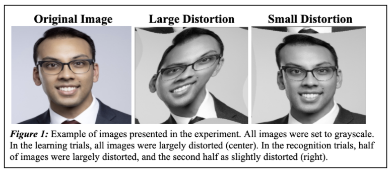

#  Face Manipulation Recognition Task
> Written by: Claire Dinauer
> 
> December 11, 2020
> 
> Experimenters: Claire Dinauer and Nikka Mel Ruelos
 
## The Problem

With the rapid expansion of social media platforms over the past decade, the use of face distortion and filters for users’ entertainment has exploded. Many of these filters introduced by social media platforms, most notably Instagram and Snapchat, warp users’ face or certain facial features beyond recognition. While these filters are fun for entertainment purposes, questions arise regarding to what extent they affect how well we can recognize individuals. 

Previous literature suggests that people can to recognize and reconstruct faces to a respectable degree when viewing them with occlusions, in different lighting, from different angles, when slightly blurred, and in different contexts (Lu & Liu, 2008; Lee et al., 2005; Lam & Yan, 1998; Harmon, 1973). This brings us to ask, to what extent is recognition impaired when the image of a face distorted? And how may the amount of distortion impact later recognition? Are we more likely to recognize the distorted face or a more “normal” face?

## Our Interests

Given the literature and culture surrounding this topic, we are interested in exploring how well people are able to recognize faces after seeing a largely distorted version of them, and whether people are better able to recognize the faces when presented with the same or a lesser amount of distortion. We are also interested in investigating whether asking participants to recall an image versus a face has an effect on recognition abilities. To do this, we created an “old-new” recognition task, in which recognition required individuals to distinguish “old” (previously presented) faces from “new” (newly presented) faces with varying degrees of distortion. All faces presented in the learning task, which would be considered old during the recognition task, were largely distorted by stretching the images both vertically and horizontally to create a “wave” effect, similar to that of a distortion filter offered by Snapchat. 

## Participants

The participants were 11 undergraduate college students (nine men, two women, age range: 20-22 years) at the University of California, Los Angeles. The participants participated for course credit in an upper-division psychology course. All participants were fluent in English.

## Design

The experiment utilized a two-way within-subjects design to investigate how manipulating the amount of image distortion and instruction types affect one’s ability to recognize faces in an old/new recognition task. The amount of distortion was operationalized as the degree to which images were warped to make faces less recognizable, while instruction type was operationalized as the wording of the set of instructions given before each learning phase. The amount of distortion was manipulated across two levels: large distortion and small distortion. In the large distortion condition, faces were distorted with a wave stretch frequency of seven (i.e to the seventh degree); in the small distortion condition, faces were distorted with a wave stretch frequency of three (i.e. to the third degree), meaning that the amount of distortion was mild and the faces more closely resembled normal human faces. The type of instructions was also manipulated across two levels: image recognition and face recognition. In the image recognition condition, participants were instructed to remember each image, as they would later be tested on their image recognition abilities. In the face recognition condition, participants were instructed to remember each face, as they would be tested on their face recognition abilities. The dependent variable under investigation was the participants’ performance statistics, specifically pertaining to their percentage of correct responses, d' (sensitivity), and logβ (bias).

Each image was presented in a randomized order. Instruction type was also randomized, in which subjects either received the face instructions (FI) or image instructions (II) first. The amount of distortion applied to each image in the recognition portion of the task was randomized, in which half of the images were largely distorted (LD) and the other half were slightly distorted (SD).

## Materials and Apparatus

Stimuli for the experimental trials consisted of 120 frontal-view professional headshot photos, with images of 60 women and 60 men who varied in terms of appearances, ages, and racial backgrounds. All images were set to grayscale colors to avoid ceiling effects. The images were cropped into squares with consistent dimensions to ensure that faces were in the center of the screen. Sixty of the 120 images were randomly assigned to be stimuli presented during one of the two learning trials, which would be the old images in the old/new task. The remaining sixty images were assigned to be the new images, or the noise, to be presented during the recognition trials of the old/new task. The code for the experiment was written in Python and used PsychoPy for core, visual, GUI, event, and data functions.

## Procedure

Participants were instructed to run the experimental file through Python. Participants were first prompted to enter their subject information, such as initials and age. Before the experiment began, the 120 face photos were randomly assigned and equally divided to be a stimulus or noise face. Next, one of the two sets of instructions was shown to the participant, in which instruction type was counterbalanced by randomly assigning subjects to view the face instructions or image instructions first. After the instructions were shown, participants were given 3 seconds to memorize each of the 30 faces in the set. All of the stimuli faces were largely distorted in the learning portion of the task. Participants were then told to identify the faces based on whether they saw the face in the previous set (“old”) or did not see the face (“new”). The participant would then see the 30 stimuli headshot photos (old faces) and 30 noise headshot photos (new faces) in a randomized order, in which 15 stimuli and 15 noise images were randomly assigned to the large distortion condition and the remaining 15 stimuli and 15 noise images were assigned to the small distortion condition. Figure 1 (below) offers an example of how images were distorted for the learning and recognition tasks. The faces were presented one at a time, each for 700 milliseconds. After each face presentation, the participant was prompted to press ‘1’ on their keyboard to indicate that the face was old or press ‘2’ to indicate that the face was new. This procedure was repeated for the second set of instructions until participants had viewed all 120 headshot photos. To avoid confusion or interference, headshot photos were not repeated across conditions.

 
 

## Results and Statistical Analysis

We analyzed the results of the old-new recognition task by determining the hit rates and false alarm rates from the class data to then calculate the average percent of correct responses, d' (bias), and logβ (sensitivity). Table 1 and Table 2 depict our own data measures to compare with the average class performance in Table 3. Overall, the average percent of correct responses across trials was 65.9%. Looking at our own data, we infer that our overall percent of correct trials (PcClaire = 67.5%, PcNikka = 66.7%) was reasonably similar to the average participant’s percent of correct trials. However, looking again at our data, Nikka and I received statistically higher hit rates (hClaire = 0.75, hNikka = 0.717) as well as slightly higher false alarm rates (fClaire = 0.40, fNikka = 0.383) than the class average (h = 0.65, f = 0.332). Our d' values were also slightly higher than the average d' value for the class, though not significantly, meaning that our Noise and Signal+Noise curves are slightly further apart relative to our class.

  

The average bias of logβ = 0.02 was extremely close to that of an unbiased observer, in which logβ = 0. Looking at our data, Nikka and I exhibited negative bias values, indicating a distinct preference toward more ‘old’ responses than ‘new’ responses when classifying faces. Due to compiling the 120 faces to be used for the trials, it is likely that our exposure to the stimuli before the experiment interfered with how we classified faces, leading to our higher hit rates, higher false alarm rates, and preference to classify faces as old. 

Based on the class data in Table 4, participants showed a preference toward more ‘old’ responses than ‘new’ responses for large distortions with logβLD = -0.212. This is also reflected in the criterion 𝜆LD = 0.230. For small distortions, participants show a preference toward more ‘new’ responses than ‘old’ with logβSD = 0.211. Compared to the large distortion trials, the criterion shifted right in the small distortion trials to 𝜆SD = 0.659.  Based on the class data in Table 5, participants did not show a distinct difference in bias based on the type of instructions given; in fact, the logβ values being close to 0 are reflective of an unbiased observer.

  

## Two-Way Within-Subjects ANOVA

A two-way within-subjects ANOVA was conducted for the percent of correct responses to test for significant main effects or interactions. There was no significant main effect of amount of distortion on participants’ percentage of correct responses (F(1,10) = 0.948, p > 0.05). There was also no significant main effect of type of instructions on participants’ percentage of correct responses (F(1,10) = 2.539, p > 0.05). There was no significant interaction between the amount of distortion and type of instructions on participants’ percentage of correct responses (F(1,10) = 0.233, p > 0.05), which also can be observed visually in Figure 2 (below).

  

## Paired-Sample T-Tests

A paired-sample t-test was used to analyze participants’ sensitivities to test if the amount of distortion had a significant effect on d'. There was not a statistically significant difference in d' based on amount of distortion (t(10) = -1.190, p = 0.261). A paired-sample t-test was also used to analyze participants’ biases to test if the amount of distortion had a significant effect on logβ. There was not a statistically significant difference in logβ based on amount of distortion (t(10) = 1.7656, p = 0.108). With each p-value > 0.05, we fail to reject both null hypotheses (H0) for the amount of distortion, in which the mean difference between sensitivity measurements is equal to 0 and the mean difference between bias measurements is equal to 0. 

Next, a paired-sample t-test was used to analyze participants’ biases to test if the type of instructions had a significant effect on logβ. There was not a statistically significant difference in d' based on instruction type (t(10) = -0.645, p = 0.533). A paired-sample t-test was then used to analyze participants’ sensitivities to test if instructions type had a significant effect on d'. There was not a statistically significant difference in d' based on instruction type (t(10) = -0.879, p = 0.400). With each p-value > 0.05, we fail to reject both null hypotheses (H0) for instruction type, in which the mean difference between sensitivity measurements is equal to 0 and the mean difference between bias measurements is equal to 0. 

## Conclusions

In this study, we examined signal-detection models of face recognition using data that were obtained from an old-new recognition task. Based on the data we gathered, we ultimately found no significant effect of distortion amount nor instruction type on the percent of correct trials, sensitivity, or bias. Additionally, there was no significant interaction between instruction type and distortion type based on the percent of correct trials. Although our results were not significant, it was interesting to observe the differences in logβ and 𝜆 across the levels of distortion, as hit rates and false alarm rates for largely distorted images appeared to be decently higher than the hit rates and false alarm rates for slightly distorted images, as depicted in Table 4. This difference in logβ and 𝜆 may have been due to participants feeling more inclined to classify a face as ‘old’ when the amount of face distortion in the recognition trials matched the amount of distortion in the learning trials, which were all largely distorted. In other words, participants seemed to be best at identifying signals congruent with the original distortion amount. Our lack of significant results may be due to our small sample size and generally short experiment; in the future, it would be interesting to try the experiment again with a greater number of stimuli. 

One potential issue was that some faces may have been more recognizable than others due to varying hairstyles, race, facial hair, and ages. Though we tried to include a large variety of faces, this may have made some faces more identifiable due to the low number of trials. Also, to account for the same-race effect, it would be interesting to conduct a larger number of trials and counterbalance the race of the faces used for noise and stimuli to investigate if participants of different backgrounds can best recognize faces of their own race even when distorted.

On a separate note, we were running the same experiment and taking the same measures for each section of the experiment regardless of instruction type. That said, we did not concretely test whether participants were recalling the exact image of each face with the same amount of distortion for the image instruction trials; this would require a change in experimental design to emphasize the instructions to participants as well as a change in our operational definition of the type of instructions. Therefore, if we were to adjust our data with regard to the expectation that participants would classify images presented exactly the same as images from the learning phase as ‘old’, we would likely observe a shift in the data during the image instructions section of the task. In fact, by adjusting our data to consider this, the sensitivity is estimated to be d' = 0.991, which more closely resembles the sensitivities for the face instructions (d' = 0.935) and large distortion trials (d' = 0.92) from Table 4 and Table 5. Of course, we cannot draw any conclusions from this estimation, yet we would predict similar results to those of the large distortion condition due to the congruency of the amount of distortion in the learning and signal trials.

Overall, we would be interested in expanding our experiment’s reach and reconfiguring the operationalization of our variables to more efficiently test the extent to which distortion and instruction type may affect face recognition, as well as explore additional questions regarding how manipulating the types of distortion and types of images used for stimuli may affect face recognition.

## References

Harmon, L. D. (1973). The recognition of faces. Scientific American, 229(5), 70-83.

Lam, K. M., & Yan, H. (1998). An analytic-to-holistic approach for face recognition based on a 
single frontal view. IEEE Transactions on pattern analysis and machine intelligence, 
20(7), 673-686.

Lee, K. C., Ho, J., & Kriegman, D. J. (2005). Acquiring linear subspaces for face recognition 
under variable lighting. IEEE Transactions on pattern analysis and machine intelligence, 
27(5), 684-698.

Lu, H., & Liu, Z. (2008). When a never-seen but less-occluded image is better recognized: 
Evidence from old–new memory experiments. Journal of Vision, 8(7), 31-31.

logβLD
